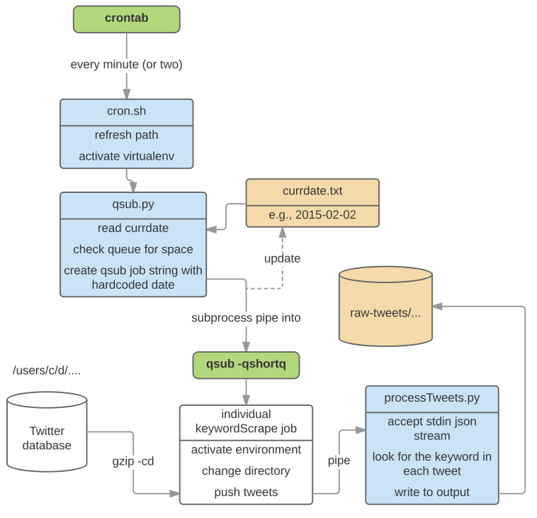

# VACC-keyword-search
Base for doing keyword searching through a Twitter database

The basic approach is to use the cron scheduler to make sure that around 100--150 jobs are running all the time.
Each job is short, processing at most an hour of Tweets, so that each job takes less time to run and can utilize the shortq, which has a limit of 200 jobs that run immediately under most circumstances.

Cron calls the shell script `cron.sh` directly, and that shell script invokes the Python script `qsub.py` to handle the more complex logic of dates and job submission (which is just easier in Python).
The work of looking through Tweets happens in `processTweets.py`.
By utilizing pipes and unzipping from disk directly into Python, no unzipped files are writtent to disk (this would be prohitively slow and use too much storage).
Instead, just the minimum necessary output from the search is written to disk, by Python.

